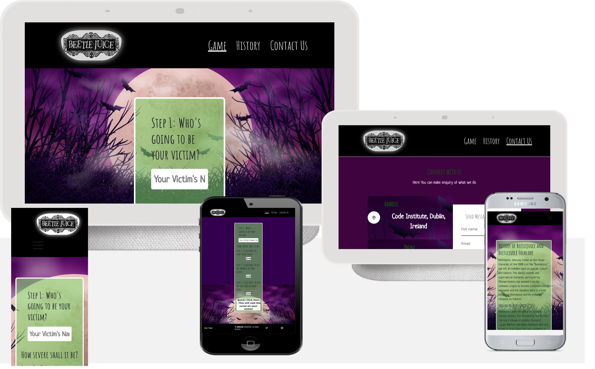
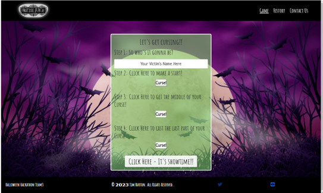
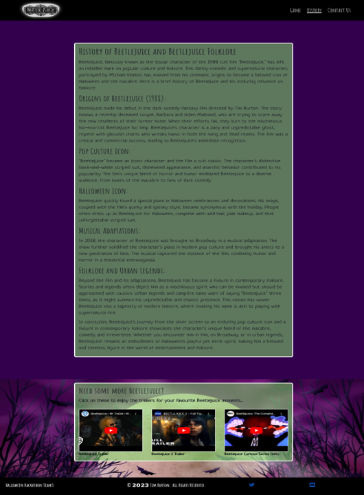
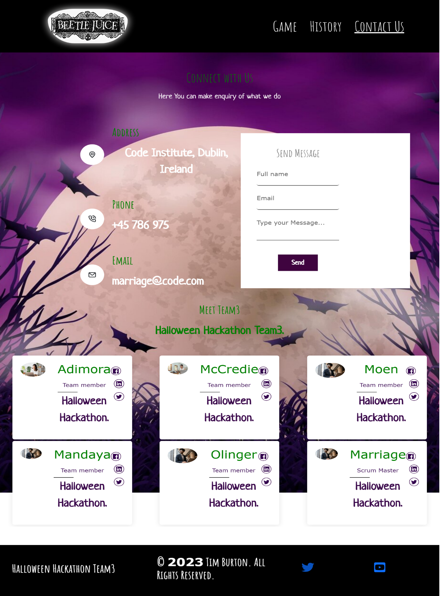
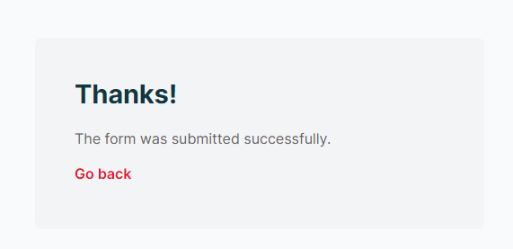
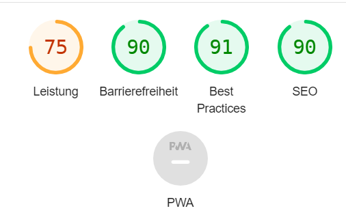
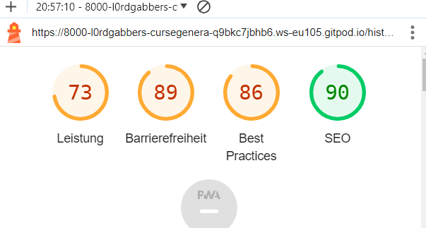
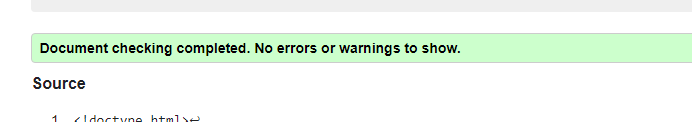
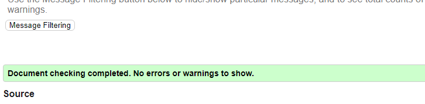
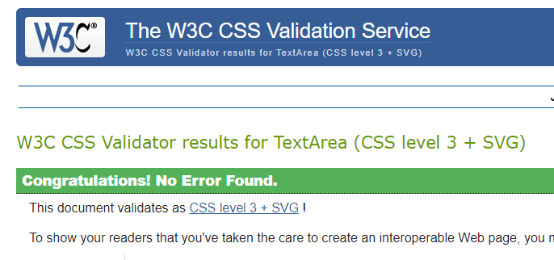

<h1 align="center"><strong>🎃🎃🎃 Phantom Forge: A Halloween Hackathon 🎃🎃🎃</strong>
</h1>

<h1 align="center"><strong>:🦇🦇 The BEETLEJUICE curse generator 🦇🦇 </strong></h1>


# Beetlejuice

The Beetlejuice Cursifier is a fanbase site dedicated to the movie character Beetlejuice by Tim Burton. It features three main pages, the first being a sort of mini game which allows for a user to create an automatically generated (and perhaps also funny) curse.
The 'history' page features a few paragraphs of text detailing the history, both canonical and filmographical, regarding the popular halloween film character and the last being the contact page a user can can make enquiry my filling a simple form.


. View the live site here
 [here]( https://)



## Sprints
### Friday
#### Sprint 1
- AJ - Assigned to aqcuire background images and implement them into the html files. 👍
- Uju - Assigned to Implement a Bootstrap Navbar 👍
- Gabriel - Assigned to implement buttons and input fields into the index file. 👎 (Became preoccupied with pull request issues)
#### Sprint 2
- AJ - Assigned to implement fonts for whole page. 👍
- Uju - Assigned to implement stylings and hover effect for navbar anchors. 👍
- Gabriel - Assigned to add text to the history page and upload audio files to assets folder 👍
- Marelius - Assigned to pick up the slack on implementing buttons and input fields into index file. 👍
#### Sprint 3
- AJ - Assigned to add stylings to the history page. 👍
- Uju - Assigned to fix up the contact page. 
- Sam - Assigned to rig up the cursifiying code. 👍
- Marelius - Assigned to add audio event handlers, which target the main page's buttons.
- Gabriel - Assigned to touch up on small styling details on main page, including navbar and main game. 👍

## Features 

### Site wide
*	Navigation Menu
*	Contains links to the Beetlejuice Logo,  History, and Contact pages and will be responsive at 320px, 600px, and 50em. 1024px
*	This will allow users to easily navigate between the pages within the site on these sizes devices.


*	Footer
*	This  contain icons as links to social media websites that will open in new tabs. Icons will be accessible to the visually impaired who may be using a screen reader, by the use of aria labels. 


## Landing Page
* Landing page image
* This will immediately you what the Site is all about.


*	
## History Page
* Below is the image of the History page.



* The history page tell the old History of Beetlejuice and Beetlejuice Folklore
* It alse feature some the you tube video for more information

## Contact page
ContactPage
This page shows the contact form

*	Contact form
*	This contact form is implemented to allow users to contact 'BeetleJuice Team ' 
*	Username (is a must;  if the user did not put in his/her name, the system will complain that the name must be writing)
*	Email (a must ;if the user did not put in his/her email and must contain(@), the system will complain that the email with (@) must be writing)
* On successful submission of the contact form, the user will be navigated to Thank.html displaying Thank you message.





## The succesful Message
*  This page shows that the user successful submit the contact form.




## Tsection
### Quiz  section Page( the credit goes to this site https://youtu.be/2Bpiluefkh8 , it is a You Tube  tutorial video)
* This page has ten(10) questions and four (4)options to select from each time a question is being asked
The  consists of ;
1.Score borad for the Great Score
2. Score board for a poor score or result
3. The user must select option before going to another question


## The following steps below shows how the App works


## Existing  Features
*	Responsive design
*	There are some animations on the site
*	Contact form and thank you message
*	The You Tube videos that show further history of BeetleJuice
*	

### Features Left to Implement

* 	As a future enhancement, the contact form will be updated with to send an email to “Beetlejuice Team 's email” and give the user notification information.
*	There would be dedicated Twitter, youtube, and Facebook handle dedicated to 'FunTime-Quiz'
*	There should Google map showing the location of Beetlejuce company
*  
*

## Design(WireFlame)

## Home Page
![Game page]
<br><br>

## History Page

<br><br>

## contact Page

<br><br>


## Technologies

* HTML
    * The structure of the Website was developed using HTML as the main language.
* CSS
    * The Website was styled using custom CSS in an external file.
* Javascripts
    * The Website was interative using custom Javascript in an external file.
* Bootstrap5.0
    * The Website Navbar was from Bootstrap 5.0
* Visual Studio Code
    * The website Nav was developed using Visual Studio Code IDE
* GitHub
    * Source code is hosted on GitHub and delpoyed using Git Pages.
* Git 
    * Used to commit and push code during the development opf the Website
* Font Awesome
    * Icons obtained from https://fontawesome.com/ were used as the Social media links in the footer section. 


## Testing 

### Responsiveness

All pages were tested to ensure responsiveness on screen sizes from 320px and upwards as defined in [WCAG 2.1 Reflow criteria for responsive design](https://www.w3.org/WAI/WCAG21/Understanding/reflow.html) on Chrome, Edge, Firefox and Opera browsers.

Steps to test:

1. Open browser and navigate to [BettleJuice]( https/)
2. Open the developer tools (right click and inspect)
3. Set to responsive and decrease width to 320px
4. Set the zoom to 50%
5. Click and drag the responsive window to maximum width

Expected:

Website is responsive on all screen sizes and no images are pixelated or stretched.
No horizontal scroll is present.
No elements overlap.

Actual:

Website behaved as expected with the exception of switching to landscape . 

Website was also opened on the following devices and no responsive issues were seen:

- Oukitel C21 Pro
- TCL 30 Pro
- iPhone SE
- Samsung Galaxy Tablet

### Accessibility

[Wave Accessibility](https://wave.webaim.org/) tool was used throughout development and for final testing of the deployed website to check for any aid accessibility testing.

Testing was focused to ensure the following criteria were met:

- All forms have associated labels or aria-labels so that this is read out on a screen reader to users who tab to form inputs
- Color contrasts meet a minimum ratio as specified in [WCAG 2.1 Contrast Guidelines](https://www.w3.org/WAI/WCAG21/Understanding/contrast-minimum.html)
- Heading levels are not missed or skipped to ensure the importance of content is relayed correctly to the end user
- All content is contained within landmarks to ensure ease of use for assistive technology, allowing the user to navigate by page regions
- All not textual content had alternative text or titles so descriptions are read out to screen readers
- HTML page lang attribute has been set
- Aria properties have been implemented correctly
- WCAG 2.1 Coding best practices being followed

Manual tests were also performed to ensure the website was accessible as possible and an accessibility issue was identified.

Issue : After keyboard controls were implemented, while testing the site with windows 'Narrator' screenreader, it was not clearly known what the purpose of the labels/checkboxes were. An aria-label label was added to the labels for screen readers to alert them that the labels were clickable and what their purpose was. Note:  I was only able to perform thise text of th e time factor.

### Lighthouse Testing

### Home Page


### History Page



### Contact Page


### Functional Testing

**Navigation Links**

Testing was performed to ensure all navigation links on the respective pages, navigated to the correct pages as per design. This was done by clicking on the navigation links on each page.

| Navigation Link | Page to Load    |
| --------------- | --------------- |
| Game            | index.html |        
| History         | history.html    |
| Contact Us      | contact.html    |

All link navigated to the correct pages as exptected.

**Form Testing**

The form on the  Home page was tested to ensure it functioned as expected when correct data was input and when incorrect data was input. The following test scenarios were covered:

_Scenario _

Steps to test: As expected

1. Navigate to [BettleJuice - Game Page]( https://)
2. Enter the name of the victim to be curse:
    Name: AdeBe 
3. Click Here to make a start!
     This produces a sound
4. Click Here to get in the middle of your Curse!
    This produces a sound

5. Click Here to cast the last part of your Curse
  This produces a sound


**Footer Social Media Icons / Links**

Testing was performed on the Font Awesome Social Media icons in the footer to ensure that each one opened in a new tab and that each one had a hover affect color.

Each item opened a new tab when clicked as expected and correct hover color was present.

**Contact form**
Testing was performed on the contact page. It will navigate the Success Page(Formspree)

### Scenario One - Correct Inputs_

Steps to test:
### If the user inputs the user name and correct email with email format.
Username: Ada
Email; abe@gmail.com
Submit;
on clicking submit, It will navigate the user to Successful Message, 

### Scenario two - blank Inputs_

Steps to test:
But  if the user e.g;
Username:
Email; uju@gmail.com
Submit;
on clicking submit, there will a message telling the user that name filed must not be empty

### Scenario One - inCorrect email Inputs_

Steps to test:
But  if the user e.g;
Username: uju
Email; gmail.com
Submit;
on clicking submit, there will a message telling the user that email field must contain @ 

### Actual:
Website behaved as expected


### Validator Testing 

- HTML
  - No errors were returned when passing through the official [W3C validator](https://validator.w3.org)
### Game section



### History section



### contact section


- CSS
  - There  was no found when passing through the official [(W3C validator]((https://validator.w3.org)]


 * This is yet to be resolved, but will be address in future due time factor

### Unfixed Bugs
*   

### Bugfixed

## Deployment

### Version Control

The site was designed and created by a team of 6, using the Visual Studio code editor and pulled and pushed to Git Hub to the remote repository ‘Beetlejuice’.

The following git commands were used throughout development to push code to the remote repo:

```git pull origin main ``` - This command is used to fetch changes from a remote repository and integrate them into your current local branch..

```git add <file>``` - This command was used to add the file(s) to the staging area before they are committed.

```git commit -m “commit message”``` - This command was used to commit changes to the local repository queue ready for the final step.

```git push``` - This command was used to push all committed code to the remote repository on github.

```git checkout ``` -  This Git command is used for changing the current branch you're working on.


### Deployment to Github Pages

- The site was deployed to GitHub pages. The steps to deploy are as follows: 
  - In the GitHub repository, navigate to the Settings tab 
  - From the menu on left select 'Pages'
  - From the source section drop-down menu, select the Branch: main
  - Click 'Save'
  - A live link will be displayed in a green banner when published successfully. 

The live link can be found here -  https://ujuadimora-dev.github.io/FunTime-Quiz/

### Clone the Repository Code Locally

Navigate to the GitHub Repository you want to clone to use locally:

- Click on the code drop down button
- Click on HTTPS
- Copy the repository link to the clipboard
- Open your IDE of choice (git must be installed for the next steps)
- Type git clone copied-git-url into the IDE terminal

The project will now of been cloned on your local machine for use.

 
## Team Collaborators
- AJ McCredie 
- Gabriel Marriage
- Marelius Moen 
- Marlon Mandaya
- Sam O'Brien-Olinger 
- Uju Adimora

## Color scheme
We use the  colours  combimation which mirror the pop-culture icon of Beetlejuice (purple, green, black and white).

## Credits 

* (https://www.w3schools.com/)
    *  some of the code was used from this site to create form. Styles were changed to suit styling on my Website. I recommend this site for every beginners.

   * https://stackoverflow.comThis site also help me in resovlving some issue in coding
    
### Content 

All contents and  media or image on this site was Fantasy. 
### Media

Website is live here [Bettlejuice website]( https://)
