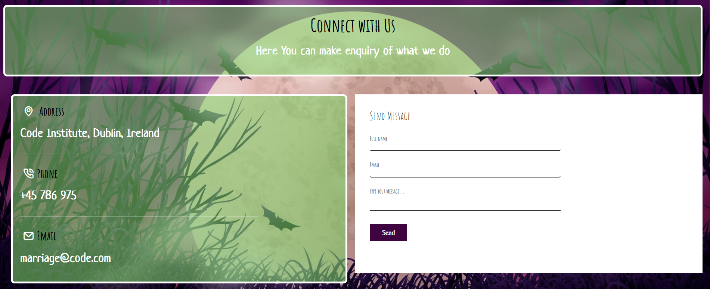

<h1 align="center"><strong>🎃🎃🎃 Phantom Forge: A Halloween Hackathon 🎃🎃🎃</strong>
</h1>

<h1 align="center"><strong>🦇🦇 The Beetlejuice Cursifier 🦇🦇 </strong></h1>


# Beetlejuice Cursifier

The Beetlejuice Cursifier is a fanbase site dedicated to the movie character Beetlejuice by Tim Burton. It features four pages, the landing page being a welcome page which provides a direct link to the mini game page which allows for a user to create an automatically generated (and perhaps also funny) curse.
The 'history' page features a few paragraphs of text detailing the history, both canonical and filmographical, regarding the popular halloween film character, and also features a few iFrames of the movie trailers. 
The last page is the contact page, where a user can can make an enquiry by filling a simple form.


View the live site
 [here](https://l0rdgabbers.github.io/curse-generator/).


## Features 

### Site wide
#### Navigation Menu
*	Contains Beetlejuice Logo, which serves as a link to the index page, as well as named links to the game,  history, and contact pages, and is responsive at 320px, 600px, and 50em. 1024px
*	This will allow users to easily navigate between the pages within the site on these sizes devices.


#### Hamburger Icon
* At 991 pixel width or below, the navbar will turn into a drop down menu which also features a drop down toggle.


#### Footer
*	This  contain icons as links to social media websites that will open in new tabs. Icons will be accessible to the visually impaired who may be using a screen reader, by the use of aria labels. 


#### Background Image
* The site contains this background image of a full moon in a purple sky with black trees and bats, because it fitted the whole theme of Beetlejuice and Halloween as well as the site's colour scheme.


### Landing Page
* This page features a gif of Beetlejuice welcoming the user to the website.
* At the bottom of the page, there is a link to the game page.


### Game Page
* This page features the main game. The user is prompted to enter the name of someone, and press the three following buttons, which generate segments of a randomly generated curse.


* Once the user has typed something into the text field, and all of the three buttons have been pressed, the final fourth button will be activated which allows the user to see Beetlejuice shouting the newly generated curse.
* Below Beetlejuice also features a refresh button, allowing the user to create a new curse.


* Before the final curse is revealed, a spinning Beetlejuice head is displayed to resemble a loading screen so that the jump from display to display is not too jarring.


### History Page

* The history page features text detailing both the canonical and filmographical history about the beloved Tim Burton character.


* It also features three youtube links via iFrames to allow the user to see the trailer for the two Beetlejuice films and the cartoon series.


### Contact page
*	This contact form is implemented to allow users to contact 'The Magic Numb3r Team' 
*	Username (is a must;  if a user did not input their name, the system will warn that the name must be written)
*	Email (is a must; if the user did not input their email, or input some text without "@", the user will be notified.)



* On a successful submission of the contact form, the user will be navigated to Thank.html displaying a thank you message, and will provide a link back to the original site.


* The contact page also features links to the Team M3mbers' LinkedIn Profiles.


### Features Left to Implement

* As a future enhancement, the contact form will notify the user that their email was successfully submitted to the team's email account
* Additional curses will be implemented, granting the user increased replayablity.
* There would be dedicated Twitter, youtube, and Facebook handle dedicated to 'BeetleJuice'

## Design 

### WireFlame
* At the very beginning of the project, the Scrum Master instructed the Team Members to create a simple wireframe of the landing page to get creative juices flowing. All of which contributed a little bit of something to the final project.


* The finalised content wireframes were then constructed to better format the final website.


### Colour Scheme
We chose the site's colours to mirror the iconic Beetlejuice (purple, green, black and white).


## Technologies

* HTML5
    * The structure of the Website was developed using HTML as the main language.
* CSS3
    * The Website was styled using custom CSS in an external file.
* JavaScript
    * The website's interactive aspects were contstructed using Javascript in an external file.
* Bootstrap 5.3.2
    * The Website Navbar was from Bootstrap 5.3.2
* GitHub
    * Source code is hosted on GitHub and delpoyed using Git Pages.
* Git 
    * Used to commit and push code during the development of the Website
* Font Awesome
    * Icons obtained from https://fontawesome.com/ were used as the Social media links in the footer section. 


## Testing 

### Responsiveness

All pages were tested to ensure responsiveness on screen sizes from 320px and upwards as defined in [WCAG 2.1 Reflow criteria for responsive design](https://www.w3.org/WAI/WCAG21/Understanding/reflow.html) on Chrome, Edge, Firefox and Opera browsers.

Steps to test:

1. Open browser and navigate to BettleJuice
2. Open the developer tools (right click and inspect)
3. Set to responsive and decrease width to 320px
4. Set the zoom to 50%
5. Click and drag the responsive window to maximum width

Expected:

Website is responsive on all screen sizes and no images are pixelated or stretched.
No horizontal scroll is present.
No elements overlap.

Actual:

Website behaved as expected with the exception of switching to landscape . 

Website was also opened on the following devices and no responsive issues were seen:

- Oukitel C21 Pro
- TCL 30 Pro
- iPhone SE
- Samsung Galaxy Tablet

### Accessibility

[Wave Accessibility](https://wave.webaim.org/) tool was used throughout development and for final testing of the deployed website to check for any aid accessibility testing.

Testing was focused to ensure the following criteria were met:

- All forms have associated labels or aria-labels so that this is read out on a screen reader to users who tab to form inputs
- Color contrasts meet a minimum ratio as specified in [WCAG 2.1 Contrast Guidelines](https://www.w3.org/WAI/WCAG21/Understanding/contrast-minimum.html)
- Heading levels are not missed or skipped to ensure the importance of content is relayed correctly to the end user
- All content is contained within landmarks to ensure ease of use for assistive technology, allowing the user to navigate by page regions
- All not textual content had alternative text or titles so descriptions are read out to screen readers
- HTML page lang attribute has been set
- Aria properties have been implemented correctly
- WCAG 2.1 Coding best practices being followed

Manual tests were also performed to ensure the website was accessible as possible and an accessibility issue was identified.

Issue : After keyboard controls were implemented, while testing the site with windows 'Narrator' screenreader, it was not clearly known what the purpose of the labels/checkboxes were. An aria-label label was added to the labels for screen readers to alert them that the labels were clickable and what their purpose was. Note:  I was only able to perform thise text of th e time factor.

### Lighthouse Testing

#### Welcome Page


#### Game Page


#### History Page


#### Contact Page


### Functional Testing

#### Navigation Links

Testing was performed to ensure all navigation links on the respective pages, navigated to the correct pages as per design. This was done by clicking on the navigation links on each page.

| Navigation Link | Page to Load    |
| --------------- | --------------- |
| Game            | index.html |        
| History         | history.html    |
| Contact Us      | contact.html    |

All link navigated to the correct pages as exptected.

**Form Testing**

The form on the  Home page was tested to ensure it functioned as expected when correct data was input and when incorrect data was input. The following test scenarios were covered:

*Scenario*

Steps to test: As expected

1. Navigate to [BettleJuice - Game Page]( https://l0rdgabbers.github.io/curse-generator/)
2. Enter the name of the victim to be curse:
    Name: AdeBe 
3. Click Here to make a start!
     This produces a sound
4. Click Here to get in the middle of your Curse!
    This produces a sound
5. Click Here to cast the last part of your Curse
  This produces a sound


**Footer Social Media Icons / Links**

Testing was performed on the Font Awesome Social Media icons in the footer to ensure that each one opened in a new tab and that each one had a hover affect color.

Each item opened a new tab when clicked as expected and correct hover color was present.

**Contact form**
Testing was performed on the contact page. Submitting a message on the form will navigate to Formspree Success Page

### Scenario One - Correct Inputs

Steps to test:
### If the user inputs the user name and correct email with email format.
Full Name: Macj Moen
Email; abe@gmail.com
Submit;
on clicking submit, It will navigate the user to Successful Message, 

### Scenario two - blank Inputs

Steps to test:
But  if the user e.g;
Full Name:
Email; uju@gmail.com
Submit;
on clicking submit, there will a message telling the user that name filed must not be empty

### Scenario One - incorrect email Inputs

Steps to test:
But  if the user e.g;
Full Name: Code Silver
Email; gmail.com
Submit;
on clicking submit, there will a message telling the user that email field must contain @ 

### Actual:
Website behaved as expected


### Validator Testing 

- HTML
  - No errors were returned when passing through the official [W3C validator](https://validator.w3.org)
### Game section


### History section


### Contact section


- CSS
  - There were no errors found when passing through the official [W3C validator](https://validator.w3.org)


- JS
  - There were no errors found when passing through the [JSHint Validator](https://jshint.com/)

## Bugs

### Fixed Bugs
#### Premature curse
##### Bug
If a user entered their name and clicked on the final "generate curse" button, the curse would generate even though no segments of the curse had been generated, and Beetlejuice would just scream your name, or part of an incomplete curse.


##### Cause

This was because, once a name was inserted, all buttons were enabled, including the final button.

##### Fix
To fix this, a new function, checkButtons() was created, which ensured that the first three buttons had been pressed at least once, before the final button would work. If the final button is pressed before the content is filled in, the placeholder will change to remind the user to press the preceding buttons.

#### No Laughing
##### Bug
The sound to be played when a button was clicked wasn't working.

##### Cause

This was because the javascript for this function was written in the HTML file OUTSIDE of a script element. This also caused the JavaScript function itself to be displayed when the generate curse button was clicked.

##### Fix
To fix this all we had to do was add an initial script tag, and this took far too long to figure out!


## Deployment

### Version Control

The site was designed and created by a team of 6, using a variety of code editors and was pulled and pushed to the "Beetlejuice" Git Hub repository.

The following git commands were used throughout development to push code to the remote repo:

```git pull origin main ``` - This command is used to fetch changes from a remote repository and integrate them into your current local branch..

```git add <file>``` - This command was used to add the file(s) to the staging area before they are committed.

```git commit -m “commit message”``` - This command was used to commit changes to the local repository queue ready for the final step.

```git push origin <branch-name>``` - This command was used to push all committed code to the remote repository on github.

```git checkout ``` -  This Git command is used for changing the current branch you're working on.

```git checkout -b <branch-name>``` - This Git command is used for creating a new branch


### Deployment to Github Pages

The live link can be found here -  https://l0rdgabbers.github.io/curse-generator/

## Team Collaborators
- AJ McCredie 
- Gabriel Marriage
- Marelius Moen 
- Marlon Mandaya
- Sam O'Brien-Olinger 
- Uju Adimora

## Agile
### Github Projects
* At the beginning of the project, team members had a brainstorm to think of ideas that the site could include. These were divided into 'Must have', 'Should have', 'Could have' and Done.
* At the beginning of every day, the issues posted to the GitHub project board were assigned to different members, with 'Must Have' issues being highest priority and 'Could have' being lowest priority.
* At the end of the day, the board would be readjusted based on what projects were completed on that day, and which remaining projects were more vital to the site.
* Upon completion, all issues in the project were completed.


### Issues
* The issues posted to the GitHub project were based on the User Stories the team had brainstormed on the first day of development.


## Credits 

* https://www.w3schools.com/ Some of the code was used from this site to create form. Styles were changed to suit styling on our Website. I recommend this site for all beginners.

* https://stackoverflow.com This site also help our in resovlving some issue in coding

### Content 
* Background Image - "Image by pikisuperstar on freepik" - [freepik.com](https://www.freepik.com/free-vector/halloween-decorative-background_9694093.htm?epik=dj0yJnU9UVFaYWdqT2lYeDkweERZdm00eUFDbGxGdFhGX1p6UnQmcD0wJm49NGZOcjktNHZkazNGTy1fY0FXUVpkQSZ0PUFBQUFBR1V5T0c4&sign-up=google)
* Logo - "post mortem fan merch site" - https://shopmortem.com/en-gb/products/beetlejuice-sandworm-lanyard
* Beetlejuice Standing - "fandom fan site" - "https://hero.fandom.com/wiki/Beetlejuice/Gallery"

